# **点屏日记 [1] - JG60046-01A**

第一次写点屏记录，之前每次点完屏就扔抽屉里吃灰了。。。​于是参考了一下和光大佬的blog，写了第一篇记录。质量不好的话请见谅（

PS:这个屏幕大概是2024年1月买的，年代有些久远了，之前拍的一些照片丢了，我会尽量补上

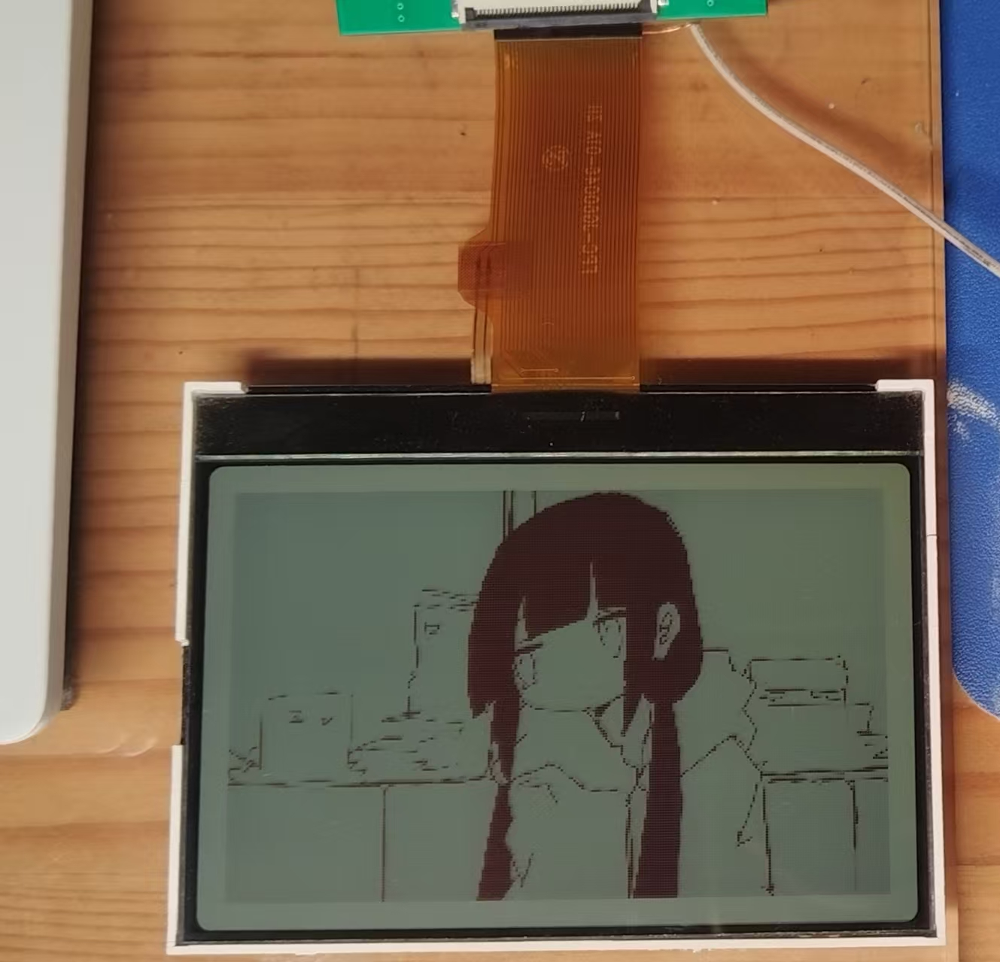


## 0x00 前言

某天，正在刷闲鱼时突然看到了一个很漂亮的反显屏（下图）。当时感觉可能是256x128之类的高分屏，于是直接打包付款一条龙：

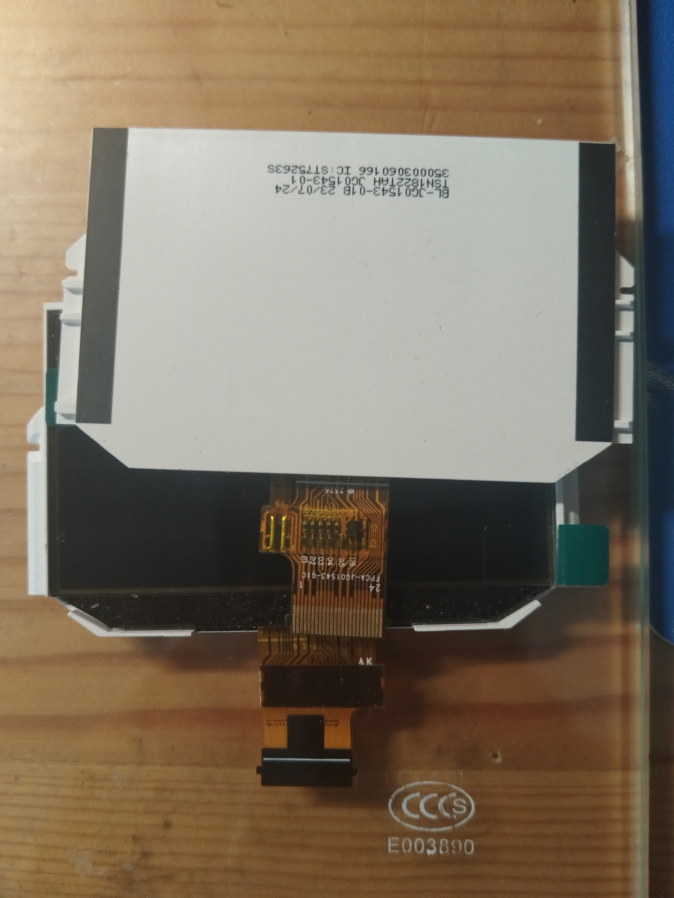

<center style="font-size:14px;color:#C0C0C0;">然后这个其实是点阵+图标的空调屏。。</center>


收到货后过了几天，卖家主动找我推销屏幕，并且表示是公司用不上的，打包送两个屏（下图

从卖家发来的图片来看，这个屏幕尺寸挺大，看着像高分屏。目测是36pin，右边有很多引脚，看起来像并口数据线，所以当时就不太想买。

不过后来一想，这个屏绝对是个挑战自我的好东西，于是就勉为其难付款了（划

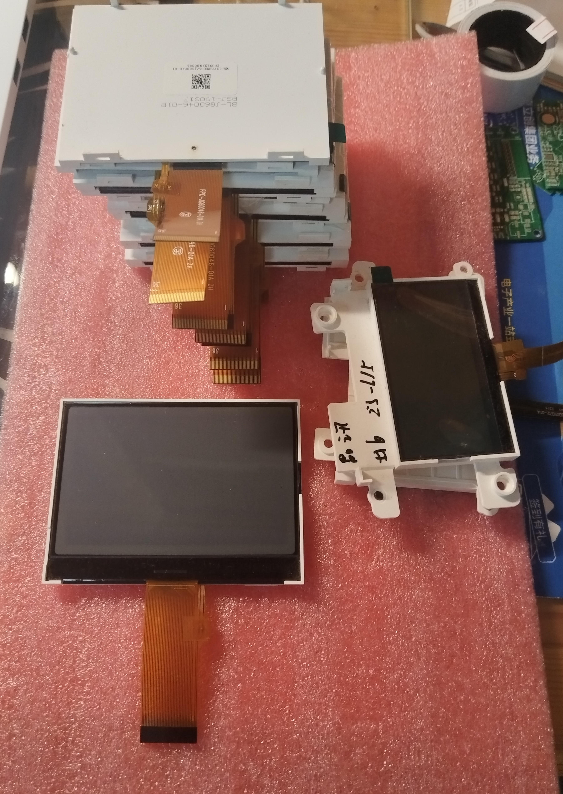
<center style="font-size:14px;color:#C0C0C0;">大概花了160多，一共17个屏（右边两个是卖家送的12864</center>

## 0x01初步分析

这个屏幕比想象中大很多。收到货，按照惯例先拆了一个内屏出来。简单数了一下屏幕的像素，分辨率`256x160`。

像这么高的分辨率，能驱动显示的芯片也是屈指可数。把目光转向芯片上，却发现引脚排布十分诡异，只有上下两排bump，并且十分规整。根据芯片到屏幕的连线，推测芯片分辨率应该刚好是`256x162`。

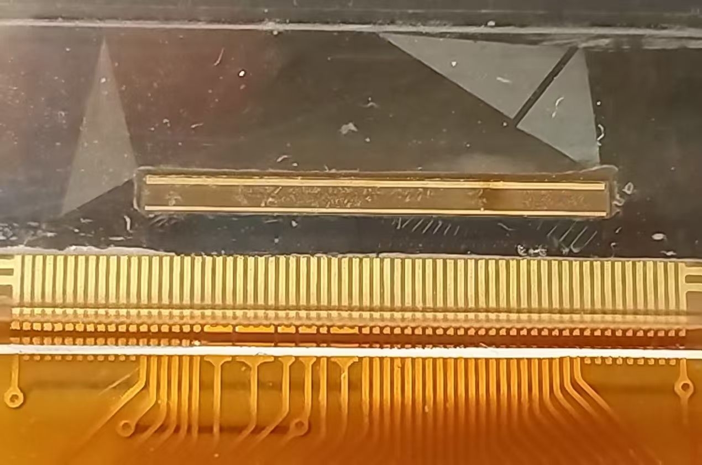
<center style="font-size:14px;color:#C0C0C0;">DIE Size : 11300x1000um（大约）</center>
<br>

右侧原本以为是数据引脚的连线都比较宽，而且分布均匀，推测是 **电源引脚**，看来这个芯片需要很多电容。在左侧可以观察到类似 `RST引脚` 的 **蛇形走线**

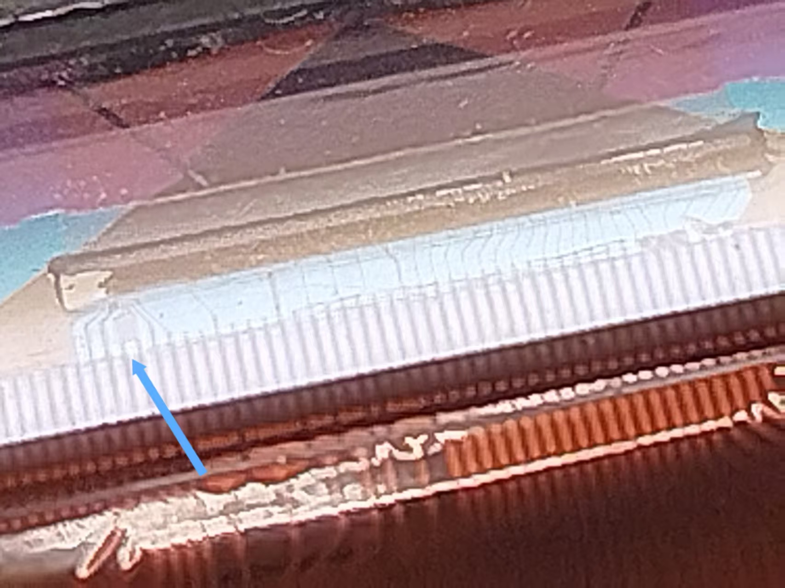
<center style="font-size:14px;color:#C0C0C0;">类似 RST 引脚的ESD蛇形走线</center>
<br>

（在我见过的芯片里，只有`ST7571`的引脚排布像这样，但它不可能是`ST7571`）随后，我翻找了我的液晶驱动芯片库，参考了`ST75256`，`NTT7553E`, `UC1628C`等等，发现没有任何一个芯片能完全对得上引脚。唯一一个比较相似的是`UC1611S`，但是仍然存在许多不合理之处（比如DIE Size对不上，引脚分布不对）

## 0x02 查找芯片

之后的研究转向了查找未知芯片，根据芯片设计风格（？）推断，这个芯片可能不属于`Sitronix`或`UltraChip`。

之后，我把目光看向了`IST联合聚晶`这家生产商：

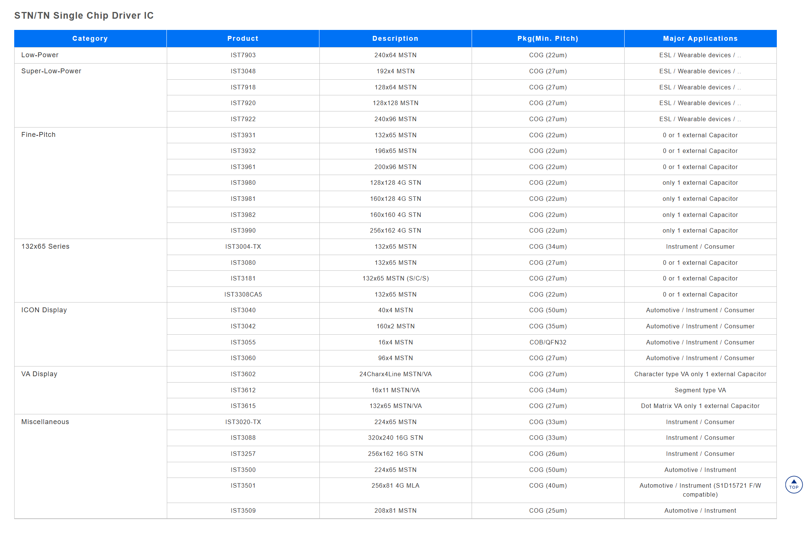

根据官网上的产品介绍，我筛选出了以下两个芯片（以下表格抄自公司产品列表）
<style>
table
{
    margin: auto;
}
</style>

| Product   | Description     | Major Applications |
| -------   | -----------     | ------------------ |
| IST3990 | 256x162 4G STN  |only 1 external Capacitor|
| `IST3257` | 256x162 16G STN |Instrument / Consumer|
<center style="font-size:14px;color:#a0a0a0;">官网给出的信息不是很多，但是根据电容可以大概排除 IST3990</center>

<br>

目前找到一个可能符合要求的芯片，但是 **根本找不到规格书!!!!**，（感觉IST系列芯片都特别难找资料，服了）各大搜索引擎查找无果后，项目又陷入了停滞.......

然而真的吗？我想起了之前在1688上买过的一款160x100屏幕，驱动芯片就是`IST3257`！

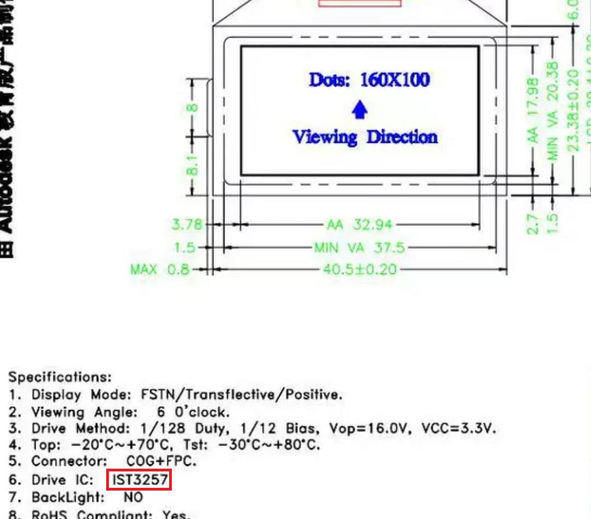
<center style="font-size:14px;color:#a0a0a0;">666远在天边近在眼前</center>
<br>
我赶忙把这款屏幕翻了出来，拆出内屏，芯片一模一样！至此，驱动芯片算是终于确定了下来。

询问客服芯片资料，结果客服发回来个 “没有哦”，呵呵。我也是气得半死，直接给他们公司打了电话问资料。终！于！拿到了规格书

## 0x03 逆向

终于可以开始逆向分析屏幕了，（其实从拿到规格书到点屏一共鸽了一年hh）。接下来的事情就很常规了，拍ITO走线，然后对引脚：

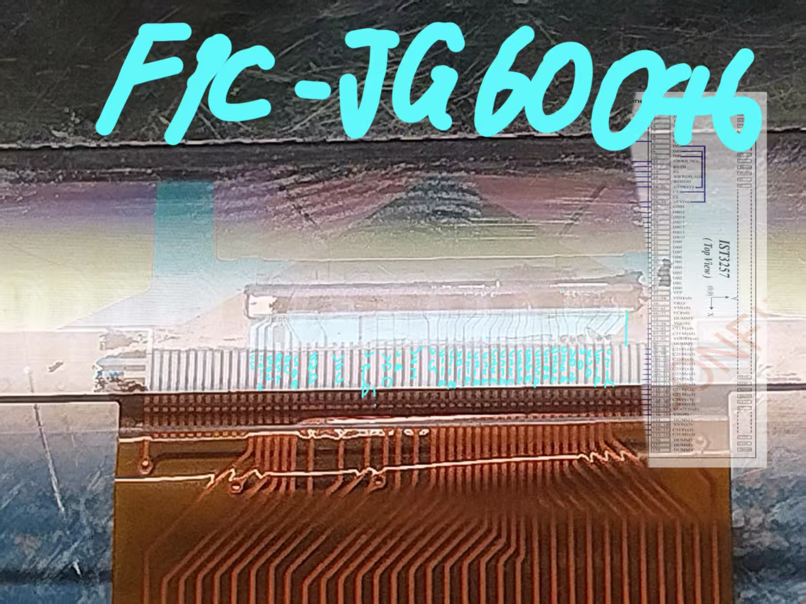

需要注意，玻璃上虽然引出了 `IM2` 引脚，但是在 FPC 上 直接连接到 `VDD` 去了，也就是固定SPI。并且玻璃没有引出 `D0~15` 的引脚，所以这货居然是个SPI屏，没想到吧


### PinOUT 1-36， IST3257 256x160 16Gray
1. ESD
2. C31M
3. C31P
4. XV0
5. V0
6. VOUT2
7. C26M
8. C26P
9. C25M
10. C25P
11. C24M
12. C24P
13. C23M
14. C23P
15. C22M
16. C22P
17. C21M
18. C21P
19. VOUT1
20. C11M
21. C11P
22. VG
23. VCI
24. VM
25. VDD
26. VPP
27. VCC
28. GND
29. SDA
30. DC
31. RST
32. SCL
33. CS
34. NC
35. A
36. K (背光两串，需要6v)

## 0x04 点屏
本次点屏使用的是 `STM32F411CEU6开发板`，具有 512 KB 的闪存、128 KB 的 SRAM, Arm Cortex -M4 32 位 RISC 内核，工作频率可达 100 MHz：

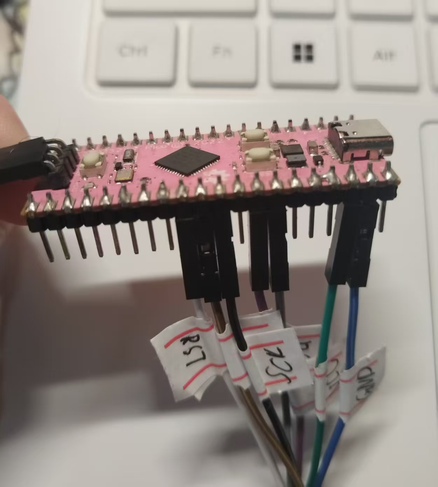

转接板（整整15颗电容，我点这么久屏都没见过这么多电容，焊了半天hh


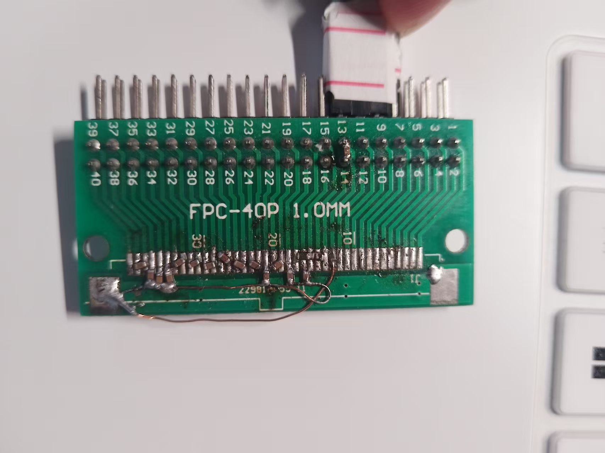

----

不光芯片封装诡异，通信也是十分独特（16bit SPI）:

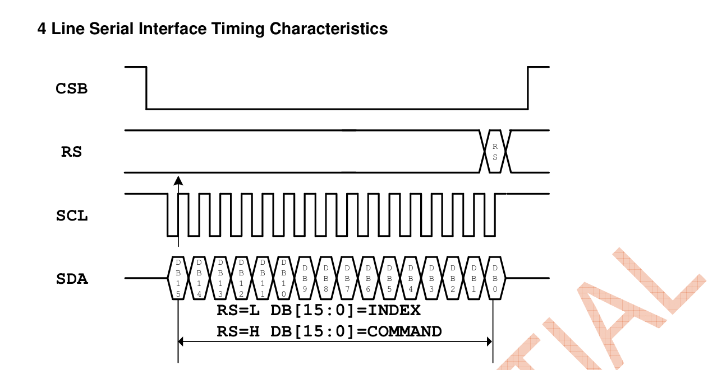

然后这个是命令手册，真是诡异到家了 还带寄存器的说是。。

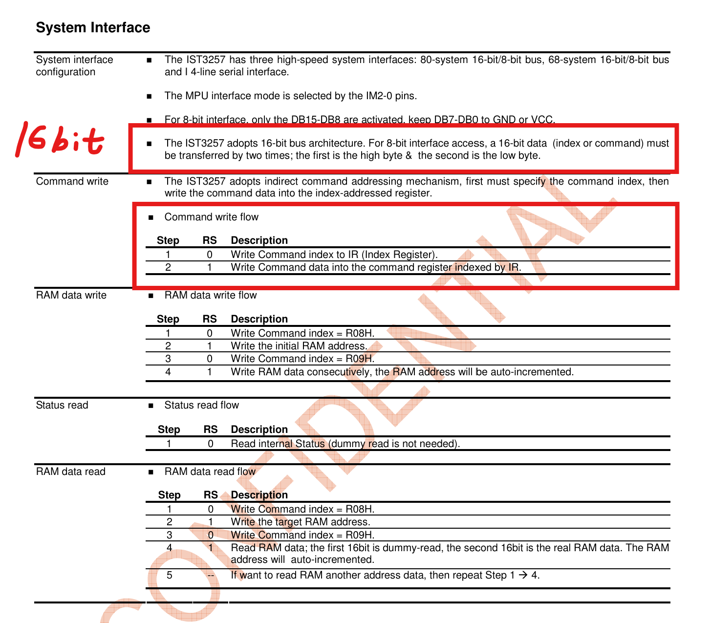

----

接下来在`STM32CubeMX`里配置SPI，这里用的是用`8-bit模式`，软件CS。如果要发送指令的话，只需要拉低CS，发两次高低字节就行。

而且这么做有一个好处，就是STM32的`16bit SPI`发送的数据是 **字节反序** 的，后续发送的图像数据也是反的。如果采用`8-bit模式`就不用担心了

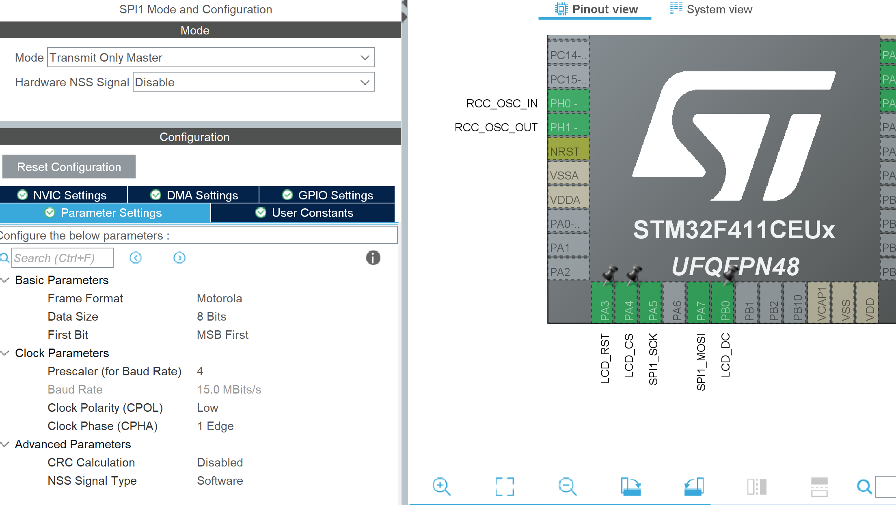

（一开始用1688商家提供的初始化序列，死活点不亮，后面把规格书什么的扔给gemini 2.5，用给出的序列一下就亮了，是参考代码电源初始化那块有问题。。。

写入初始化指令:
```c++
// --- LCD底层驱动函数 (8位SPI) ---
void SdCmd(uint16_t Command)
{
    uint8_t cmd_buffer[2];
    cmd_buffer[0] = (Command >> 8) & 0xFF; // High Byte
    cmd_buffer[1] = Command & 0xFF;        // Low Byte

    HAL_GPIO_WritePin(LCD_DC_GPIO_Port, LCD_DC_Pin, GPIO_PIN_RESET);
    HAL_GPIO_WritePin(LCD_CS_GPIO_Port, LCD_CS_Pin, GPIO_PIN_RESET);
    HAL_SPI_Transmit(&hspi1, cmd_buffer, 2, 100);
    HAL_GPIO_WritePin(LCD_CS_GPIO_Port, LCD_CS_Pin, GPIO_PIN_SET);
}

void SdData(uint16_t DData)
{
    uint8_t data_buffer[2];
    data_buffer[0] = (DData >> 8) & 0xFF; // High Byte
    data_buffer[1] = DData & 0xFF;        // Low Byte

    HAL_GPIO_WritePin(LCD_DC_GPIO_Port, LCD_DC_Pin, GPIO_PIN_SET);
    HAL_GPIO_WritePin(LCD_CS_GPIO_Port, LCD_CS_Pin, GPIO_PIN_RESET);
    HAL_SPI_Transmit(&hspi1, data_buffer, 2, 100);
    HAL_GPIO_WritePin(LCD_CS_GPIO_Port, LCD_CS_Pin, GPIO_PIN_SET);
}

// --- 第一步：硬件复位 ---
HAL_GPIO_WritePin(LCD_RST_GPIO_Port, LCD_RST_Pin, GPIO_PIN_RESET);
HAL_Delay(20); // 手册要求复位低电平至少保持10ms [cite: 1324]
HAL_GPIO_WritePin(LCD_RST_GPIO_Port, LCD_RST_Pin, GPIO_PIN_SET);
HAL_Delay(20); // 手册要求复位后至少等待10ms再发送指令 [cite: 1327]


// --- 第二步：开启振荡器与基础应用设置 ---

// 必须先开启振荡器，为后续指令提供时钟
SdCmd(0x0000);    // Index: R00h, Start Oscillator 
SdData(0x0001);   // Data:  OSC bit = 1, 启动振荡器 [cite: 1018]
HAL_Delay(5);     // 短暂延时等待振荡器稳定

// 设置驱动模式 (例如: 1/162 Duty, 16G模式)
SdCmd(0x0001);    // Index: R01h, Driver control 
SdData(0x0000);   // Data:  NL=00 -> Duty 1/162, SHL=0, SGS=0 [cite: 1037]

SdCmd(0x0023);    // Index: R23h, Display Mode Control 
SdData(0x0003);   // Data:  DSPM=100

// 设置电源参数 (Bias 和 Booster)
SdCmd(0x0004);    // Index: R04h, Power control (2) 
SdData(0x0065);   // Data:  Bias=1/12 (110), Booster=x7 (101) [cite: 1075, 1077]
                //        0b... 0 010 0 100

// 设置对比度
SdCmd(0x0005);    // Index: R05h, Contrast control 
SdData(0x0061);   // Data:  设置一个中间对比度值 (61/127)


// --- 第三步：分三步开启内部电源 (最关键的修正) ---

// 3a. 开启 VOUT1 和 VM
SdCmd(0x0003);    // Index: R03h, Power control (1) 
SdData(0x0940);   // Data: VSON=1, DC1=1, VMEN=1 
HAL_Delay(15);    // 等待电压稳定，手册要求至少10ms [cite: 1335]

// 3b. 开启 VG 和 VOUT2
SdCmd(0x0003);    // Index: R03h, Power control (1) 
SdData(0x0B60);   // Data: 在上一步基础上，增加 VGEN=1, DC2=1 
HAL_Delay(15);    // 等待电压稳定，手册要求至少10ms [cite: 1339]

// 3c. 开启 VO 和 XV0
SdCmd(0x0003);    // Index: R03h, Power control (1) 
SdData(0x0F70);   // Data: 在上一步基础上，增加 VOEN=1, DC3=1 
HAL_Delay(15);    // 等待电压稳定，手册要求至少10ms [cite: 1343]


// --- 第四步：开启显示 ---
SdCmd(0x0007);    // Index: R07h, Display control 
SdData(0x0001);   // Data:  D=1, 开启显示驱动输出 [cite: 1128
```

然后屏幕就亮起来了：（因为这里没写入数据，所以是花屏状态

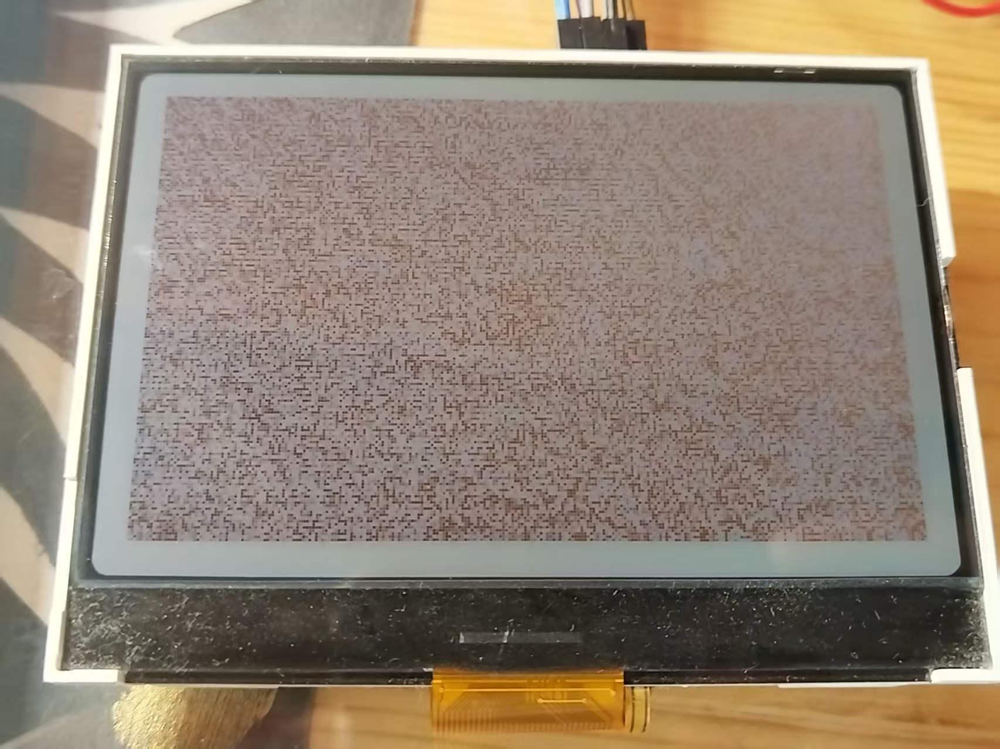

写入灰度条纹测试一下：
```c++
void IST3257_UpdateScreen(void)
{
    SdCmd(0x0008);
    SdData(0x0000);
    SdCmd(0x0009);
    HAL_GPIO_WritePin(LCD_DC_GPIO_Port, LCD_DC_Pin, GPIO_PIN_SET);
    HAL_GPIO_WritePin(LCD_CS_GPIO_Port, LCD_CS_Pin, GPIO_PIN_RESET);
    HAL_SPI_Transmit(&hspi1, back_buffer_ptr, FRAME_SIZE_BYTES, 1000);
    HAL_GPIO_WritePin(LCD_CS_GPIO_Port, LCD_CS_Pin, GPIO_PIN_SET);
}
void IST3257_DrawPixel(uint16_t x, uint16_t y, uint8_t level) {
    if (x >= IST3257_WIDTH || y >= IST3257_HEIGHT) {
        return;
    }
    level &= 0x0F;
    uint8_t *p = (uint8_t*)back_buffer_ptr + (y * (IST3257_WIDTH / 2)) + (x / 2);

    if (x % 2 == 0) {
        *p = (*p & 0x0F) | (level << 4);
    } else {
        *p = (*p & 0xF0) | level;
    }
}
for(int i = 0; i < 256; i++)
    for(int j = 0; j < 160; j++)
        IST3257_DrawPixel(i, j, i / 16);
IST3257_UpdateScreen();
```

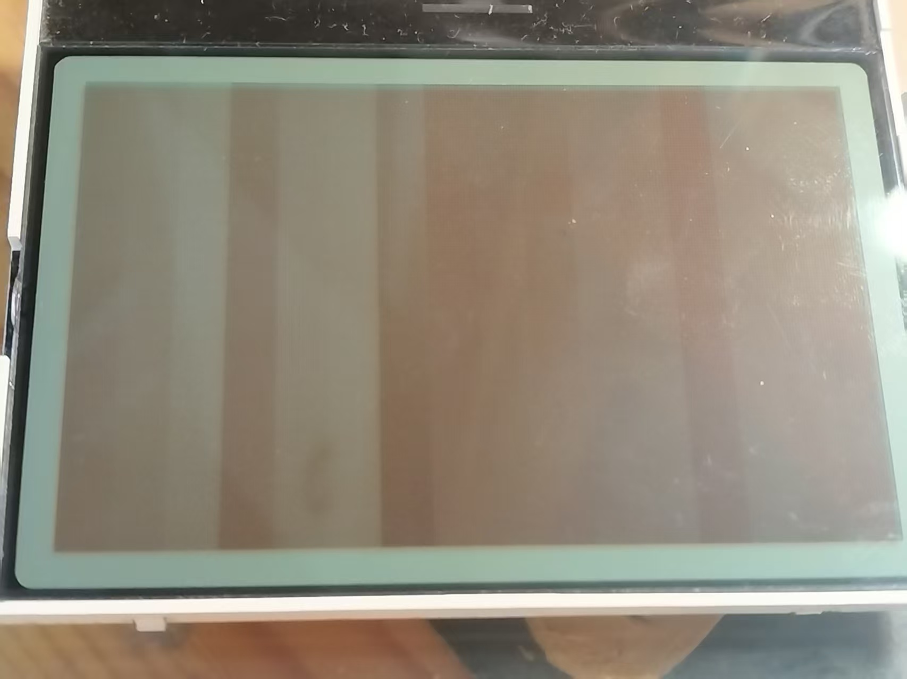
<center style="font-size:14px;color:#a0a0a0;">💩</center>
<br>

灰度特别闪，到底是哪里错了？？我也不知道，先调整一下frameRate吧：
```c++
SdCmd(0x0028);      // Index: R28h, Frame Rate Control
SdData(0x0088);     // 最高FrameRate
```

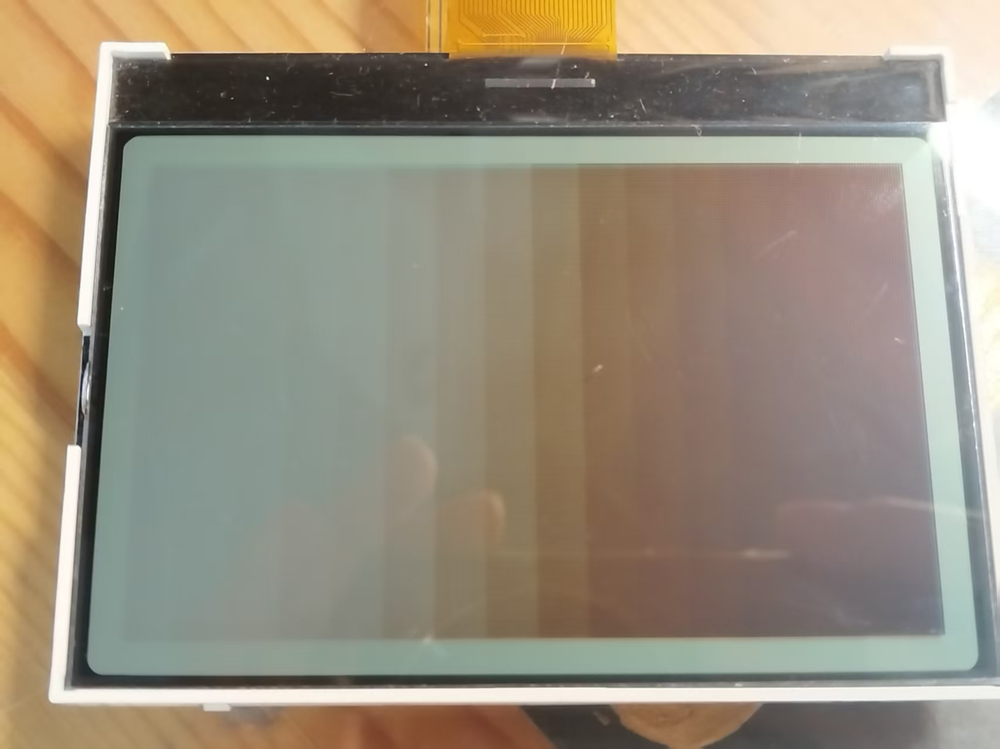
<center style="font-size:14px;color:#a0a0a0;">能看了，但还是有点闪</center>
<br>

换个测试图像看看：
```c++
for(int i = 32; i < 256-32; i++)
    for(int j = 32; j < 160-32; j++)
        IST3257_DrawPixel(i, j, (i/2) % 16);
IST3257_UpdateScreen();
```

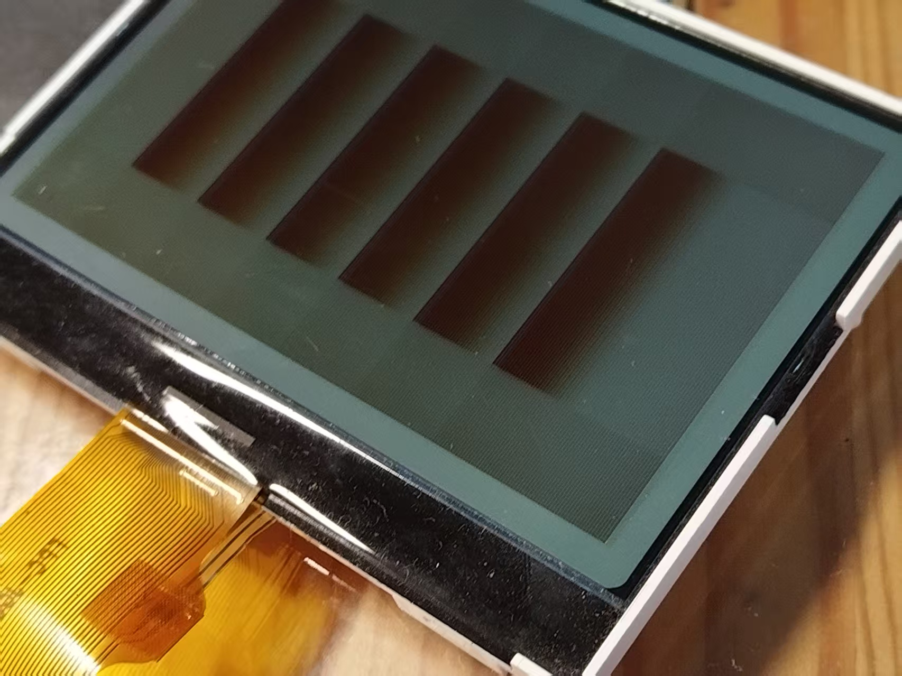
<center style="font-size:14px;color:#a0a0a0;">这次看上去不闪了，串扰挺重</center>
<br>

有CrossTalk？来个N-Line Inv🤓👆

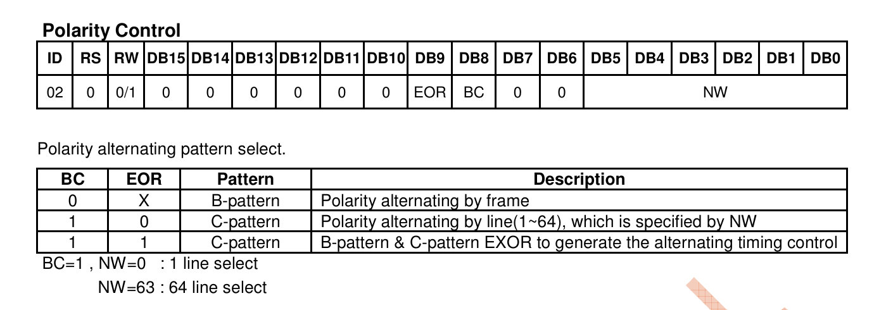
```c++
//方案B1: N-Line INV
SdCmd(0x0002);
SdData(0x0100 + 20);//20-Line 反转
//SdData(0x0000);//Frame Inv
```

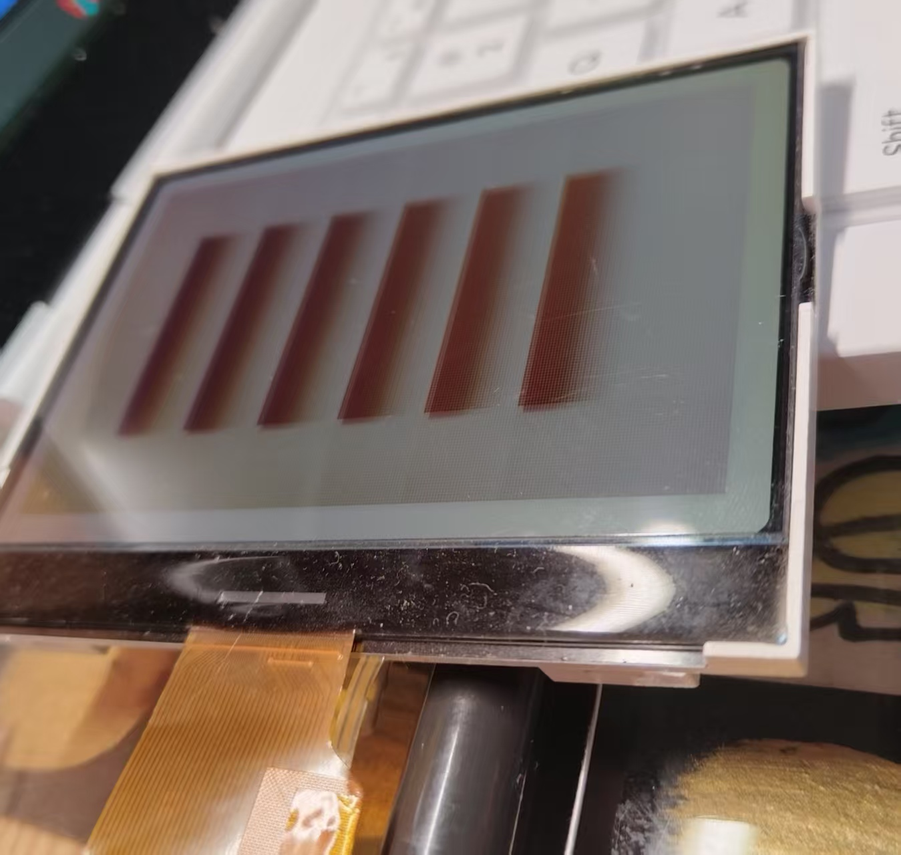
<center style="font-size:14px;color:#a0a0a0;">额，还行？</center>
<br>

参数调的差不多了，那就刷个图片进去看看:


不错，写了个USB视频串流，看看效果:

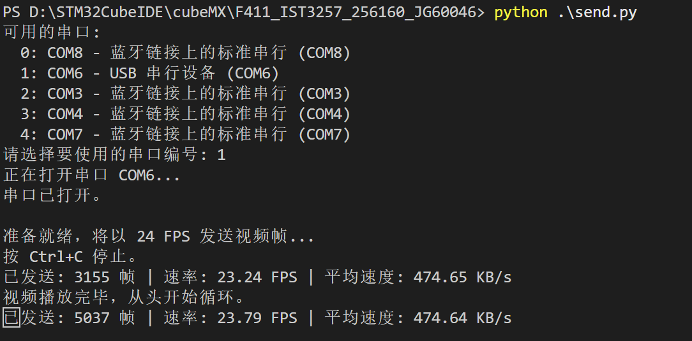

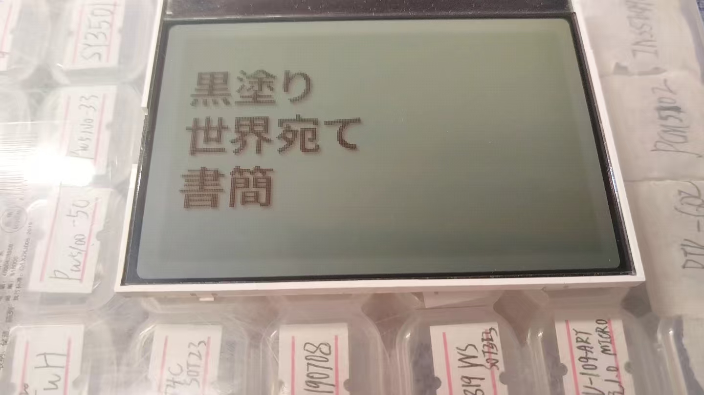

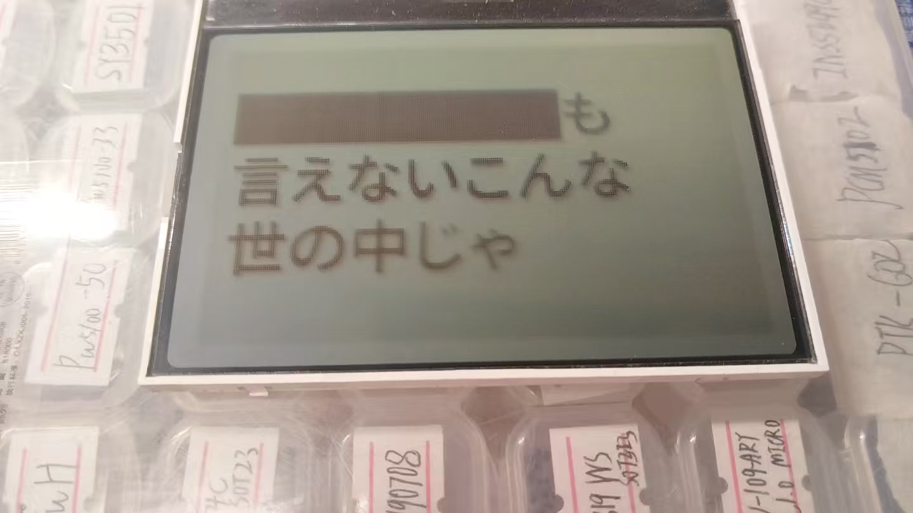

<center style="font-size:14px;color:#a0a0a0;">还挺符合原PV的（</center>
<br>

---
